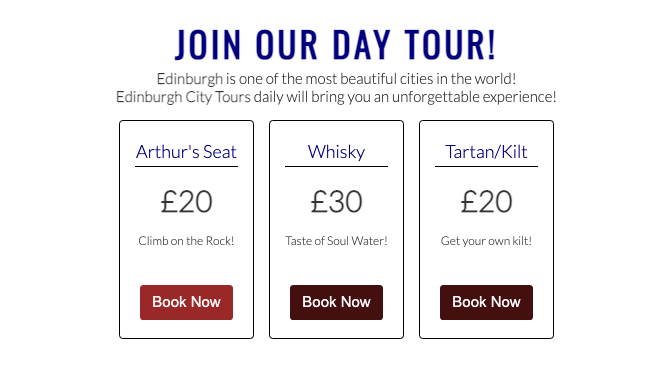
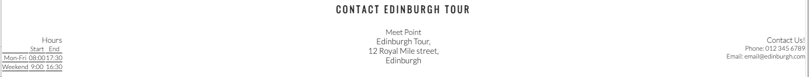
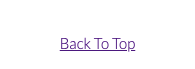

# UNFORGETTABLE EDINBURGH

Welcome to [Unforgettable Edinburgh](https://westie22.github.io/Unforgettable-Edinburgh/) website!
This is a website of booking daily tour in Edinburgh, Scotland. Edinbugh is the one of the most popular destinations for a short break holiday aka city breaks that brings you great experience.
The site contains three very attractive items for daily tour in Endibugh - Arthurs's Seat, Whisky, and Tartan/Kilt which you can choose any item per day. Each item is associated with warm-hearted locals.

Unforgettable Edinburgh will be very helful for people to explore the city and gives an never forgettable happy memory!

## Features

* Featured at the top of the page, the navigation shows the logo-name of  in the left corner: UNFORGETTABLE EDINBURGH tat links to the top of the page.
* The other navigation links are to the right: Home, Book Now, Contact which link to different sections of the same page, and Feedback links to a different page.
  
### Existing Features
- __Navigation Bar__
   
  - Featured on all two pages, the full responsive navigation bar includes lnks to the Logo, Home page, Book Now, Contact and Feedback pgae and is identical in each page to allow for easy navigation.
  - Users are allowed to navigate easily from page to page, per click across all divice without having revert back to the previous section and page. It also has "Bck to Top" button which is not included in nav section on the bottom of the page.

 

- __The landing page image__
  
  - The landing includes a photograph with text overlay to allow the user to see exactly which location this site would be applicable to.
  - This section shows the user to Unforgettable Edinbugh with an eye catching animation to grab their attention.
  
 

- __Main item list__

  - The main item list gives the users what options of daily tour that the site provides and book in advance. 'Book Now' button changes its original color when the cursor is on so users can see eaily where they are on.

 

- __Contact Edinburgh Tour__

  - This section includes tour start & end hours, meet point with address and contact detail with telephon number and email address so users can find any initial informtion for their tour.
  
 

- __Back To Top__

 - This section give users to go back to top of the navigation page eaily.
  
 

- __The Footer__

  - This section contains veriety of social media links and Copyright of Unforgettable Edinburgh tour.
  
  

- __Feedback Page__

  - This page is separated from the main page which still contains Logo, Home, Book Now, Contact and Social Media links. Users are allowed to input their personal information - Name, Emaill  and Feedback.
  - This page is covered by an image of Edinburgh City view in black & white.
  - With completed information, it can be submitted either reset.
  

### Features Left to Implement

- __Media Queries__
    - Need to fix the size for Phone device

## Testing

### Validator Testing

### Unfixed Bugs

## Deployment

## Credits

- Unforgettable Edinburgh is inspired & reffered by Code Institute module- Love Running, Corders Coffee Project and some Youtube channels.

### Contents

- The text for the Home page was taken from Love Running.
- Item list boxes are learned from [this YouTube](https://www.youtube.com/watch?v=n4R2E7O-Ngo&t=5900s) channel.
- Item list buttons/Feedback pages are learned from w3school.com and [YouTube](https://www.youtube.com/watch?v=mJgBOIoGihA&t=2335s) channel.
- Social Media links are taken by Code Institute modules - Love Running & Coders Coffee Project.

### Media
- The photos used on the home and feedback pages are from [This Open Source site](https://www.pexels.com/) 
